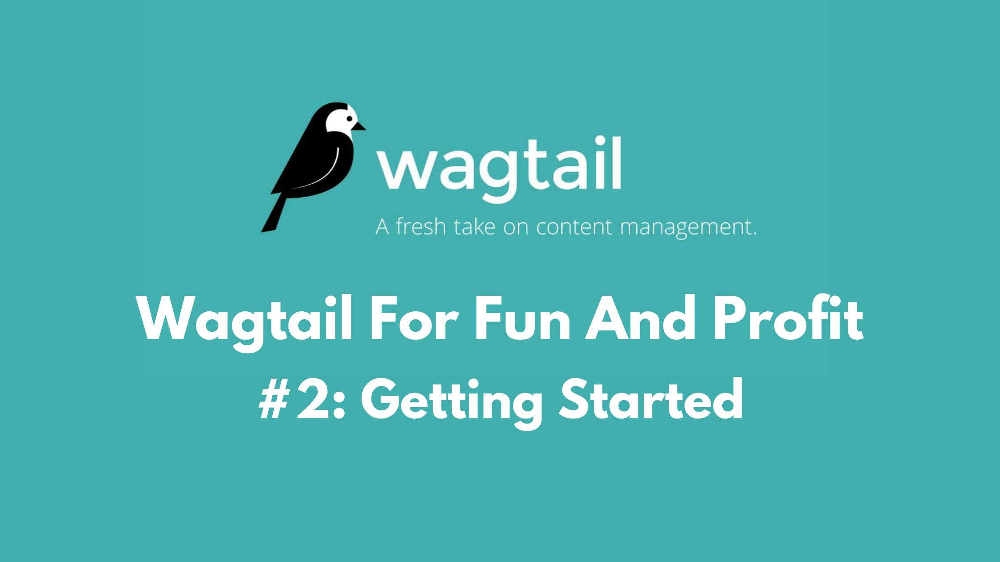

## What is Wagtail

Wagtail is a CMS built on top of Python Django. It has a beautiful UI and some wonderful features such as streamfields, intelligent images (choose the focal point of images), built-in A/B testing, a robust API for headless architecture. In my opinion, it's the best CMS for Django out there today. I also believe that it can be a wonderfully profitable CMS for freelancers and agencies who are creating client websites.

## Getting Started

Getting started in Wagtail can be both difficult and simple at the same time. Wagtail has some great documentation showing how to get started and how to use many of the python CMS's features. The problem that I see most new Wagtail developers run into is that there is no "instructions" to build a website. Wagtail provides web development tools, but not the plan. In this article I'd like to share with you some ideas on how to create client websites on Wagtail.

## The Plan

As mentioned above, the docs do not really give you a "plan" per say. So let's lay out it - what do you need to do to build a client website that you can sell.

1) Plan the layout
The first thing I like to do is plan my general layout. Is the site full width? Will I need sliders? Testimonials? Animations? Multi-columns? Single page or multipage? You need to make those decisions and have a general idea of what you need build, so that you know what kind of css/html you will need to impliment in your templates.

2) Select the right tools for project
Wagtail is a wonderful CMS on Django; but it is just a CMS. You'll need to bring in some additional tools if you want to make your development process easier. I like to use Bootstrap 5 or Bulma CSS on most projects. This gives me the prebuilt css grids, css classes, and a general styling that I can use to build client sites faster. Both of these CSS libraries are flexible, I can overwrite and adapt the style easily. This is important since I do not want to learn new classes for styles every time i build a site - repeatability is good for profitability.

3) Create Steamblocks
I recomend building Wagtail sites with Steamblocks. These are smaller chunks of code that you can template and pull into the page builder as you need them. Kalob at [LearnWagtail.com](https://learnwagtail.com/) has some great videos on how to impliment this but here is the idea: Think of a section of the website that you need - let's start with the Hero section of the landing page. You'll need a full-width section, with a large image background, maybe an overlay, some text on the one side and a button below it. With Steamblocks, you can create this template of code - using wagtail tags for each variable (text content, images, section id, additional classes). These will be filled out in the wagtail backend, so the code will be reusable in other sections of the website. Can you see the power in doing things this way?

## But What About Profit?

Building client websites with reusable blocks of code, and common css libraries will lead to profit due to the ability to repeat your work. The next website can use the same code blocks, and you'll only need to code the sections which are different. Over time, you'll be coding less and less, and instead be reusing work you've already done. This lets you create custom wagtail websites faster.

## Conclusion

Wagtail can be used to create a profitable business for freelance developers or agencies. It's a wonderfull alternative to Wordpress, for those of us who love working in Python and Django instead of PHP. The key to creating wonderful customer wesbites that are profitable is to build the website with a bit of planning - remember that any streamblock you create can be used again in future pages of the site, or in future projects and by using a common CSS library like Bootstrap, Bulma, etc - you get more proficiant, and can adapt the styling of your work more quickly.