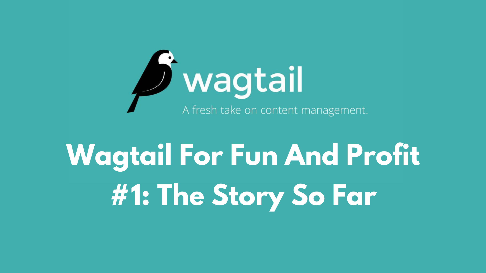

*Originally Posted on [Dev.to](https://dev.to/paqman85/wagtail-for-fun-and-profit-1-the-story-so-far-1l07)*
## What is Wagtail

Wagtail is a CMS built on top of Python Django. It has a beautiful UI and some wonderful features such as streamfields, intelligent images (choose the focal point of images), built-in A/B testing, a robust API for headless architecture. In my opinion, it's the best CMS for Django out there today. 

## For fun and Profit?

As a web developer, I create websites and web applications for my clients. Much of my work has revolved around WordPress sites over the years, and while I know that many people love WordPress and create wonderful sites with it, I've realized it's not the CMS for me. This realization has lead to my decision to stop creating new WordPress websites.

This decision felt right, but I was left with some things to figure out:

1. So do I just make static websites?
   * I could just focus on static websites, but is it the best choice? It won't be easy to sell to a client that has been in WordPress for years. They'll want something that has a similar CMS system.
   * I prefer a hybrid approach, not 100% static code, but something in the middle, a templating system.
   * Static websites won't be a solution that I can use for larger projects with business logic; I'll need a database and a backend for handling business logic.
2. CMS
   * Some of my clients will still want a content management system
   * It will need to look professional and well-made
   * It would need to be flexible and adaptable to work with complex projects
3. What language or stacks do I want to work in?
   * I want to play to my strengths, which is in Python. 

And with these criteria in mind, my search for a new solution that can provide my clients with an easy to use content CMS, while being a better developer experience for me began. 

When I began testing Wagtail, I realized it was the ideal solution for me. It's a robust CMS, with the control placed with the developer. Clients get editor rights for content but have zero access to code and no "plugins" options that add 3rd party code or other code access to break the site. It's built on top of Django, with which I'm familiar. Wagtail checked all of my boxes! :D

## But What About Profit?

I made the decision to try to build clients' sites on Wagtail about a month ago. In that time, I convinced three clients to let me build their websites on Wagtail, and I'm trying a few different approaches on how to create sites for clients using Wagtail as the CMS.

1) Static site with dynamic content:
I created a working static website first; and then replaced all of the different text with Wagtail tags to populate that content through the CMS. The result is a custom-designed HTML website with dynamic content that the client can handle through the CMS - but only the text portions. So the structure and style stay static, but the text itself can be updated. I also added a few additional dynamic pieces to the site, a testimonial section where the client can add new testimonials from the cms, a working blog (blog posts are using the streamfield builder) to add new content and a "latest posts" section that auto-updates to show the latest three posts.

This method only uses the streamfield content on blog posts. The other aspects of the site are mostly simple rich text inputs.

**Pros:**
* The site is fast, beautiful, and the client loves it. 
* I enjoyed coding it. 
* The static nature of the site makes it pretty stable.

**Cons:** 
* It's not very adaptable, consider that if the client wants changes to the site structure like add any new pages or new sections, I would need to edit the HTML templates directly.

2) Leveraging Streamfields for Custom pages:

One this second site, I took a different approach. I decided to use Bootstrap 5 Alpha as a CSS/JS framework and build out modulated sections that I would need on a few separate pages. So I focused on building the following sections: hero, testimonials, team, a FAQ with accordion dropdowns.

Now that I have these done and working correctly, I decided to add them to Wagtail's streamfields builder as custom blocks. This gives me the ability to reuse the code wherever I like and add in the text components, ids and classes through the cms. 

This is powerful. Wagtail has basically given me the tools to create my own component library. And every client project I build can add to this "component library" and make the next site easier/faster to code. All of these components can be styled by assigning a unique id or class, just as you would typically do - but that code structure can stay the same through each project. And it's all in Python and simple HTML. As I'm writing this article, I'm currently still developing this website. So far, It's been more manageable than the first wagtail site -  this approach gives more flexibility and makes the HTML templating easier.

**Pros:** 
* Easier to build, reusable components, good developer experience.

**Cons:** 
* To create a true "Page Builder" with streamfields ends up giving the user a complex feel to the on the CMS page editor. Focusing instead on using custom blocks for any complex section is better, but adds to the initial workload.

3) Headless CMS to Vue.js:

This will be my next client project, slotted to start next week. I'll be using the Wagtail CMS as the client admin section for a vue.js landing page and intake form. The Vue frontend will provide that beautiful user experience while my Django/Wagtail backend will handle the business logic and my client's admin interface. I'm excited to get this one going and will make a post in the future on how to build this kind of application.

##Conclusion
My goal for this article was to document my thought process and journey migrating from working with WordPress to Wagtail, and how I've made that fit into my business. It was successful for me; in the sense that my clients are still happy and I have profited financially from using Wagtail as a CMS for my clients. Will this work for everyone? of course not, but for those who don't want to work with WordPress, but feel stuck - there are some great options for you; you simply need to have the courage to look and try new things. If you like working in Python, be sure to give Wagail a try, but if you don't, there are plenty of other options out there!